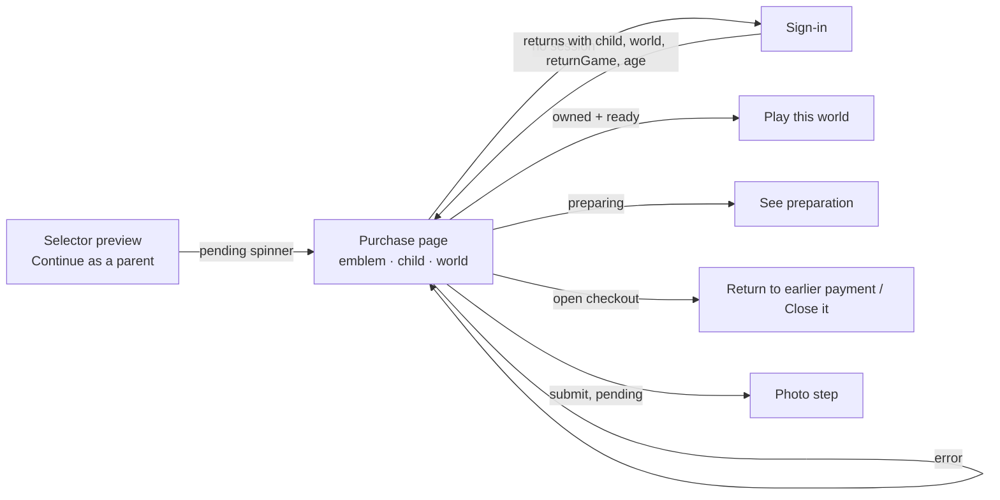
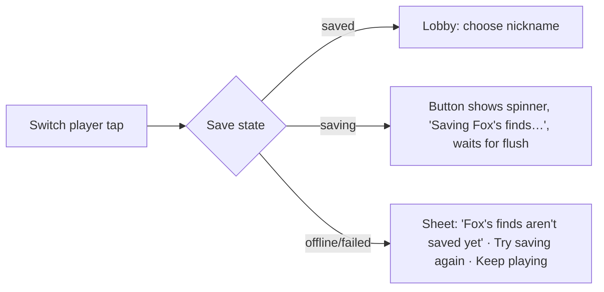

# Find Me Worlds: design review of worlds, replay and friends (Phase 2, recommendations only)

Release annotation from Codex: this is the actual installed Claude's source-only design report, preserved as received. It contains proposals, not claims that the proposed UI has been built. The existing independent Codex browser checks are recorded separately in `QA_WORLDS_FRIENDS_RELEASE_20261005.md`. In particular, the guest tray/seek dismissal and 320/390/640×360 viewport checks were completed after the brief was written; they partially resolve H9, not device gestures or child usability. The release includes a small subsequent batch addressing the unreached-board preview and new invitation/purchase state clarity. Broader completion, passport and sound redesign remains a proposed follow-up, with the child's difficulty pilot and third world still deferred.

I only read source for this review. I changed no code, config, assets or data, and made no provider requests. I didn't run a browser, take screenshots or hold any user sessions. Plan mode only allowed me to write a plan file, but I had no Write or ExitPlanMode tool, so the report is here in the reply instead.

Each finding is tagged:
- **[V]** The source proves it.
- **[O]** A design opportunity.
- **[H]** A visual or usability hypothesis that needs a check before anyone acts on it.

---

## 1. Problems the source proves

| # | Finding | Evidence |
|---|---|---|
| V1 | **Fixed totals are built in.** The passport finale only appears when a board has exactly 3 targets and 6 discoveries. The completion card says "Three gold stars!" for any count other than 4 or 5. Copy says "3", "three", "nine places" and "27 hiding spots" as fixed text. | `GameShell.tsx:144`, `ScenePlayer.tsx:620`, `ScenePlayer.tsx:671`, `en.ts:392,396,511,647`, `world-features.ts:8` (`previewText`/`previewStats`) |
| V2 | **Child controls under 64px.** Round controls and the "next place is open" toast use `fm-btn--sm` (40px). The HUD hint, Continue and replay controls are 48px. The passport's "To the map" button is 56px. | `RoundControls.tsx:31-33`, `ScenePlayer.tsx:613-614`, `ui.css:90`, `game.css:363,376,379`, `MissionCard.tsx:131`, `AdventurePassport.tsx:74` |
| V3 | **Primary actions compete.** The scene completion card can show 4 buttons. The passport finale shows 4, including Skip. After "Stay", the HUD makes "Play again" the gold primary and demotes "Next place" to a 40px ghost button. | `ScenePlayer.tsx:690-723`, `PassportCompletion.tsx:129-134`, `MissionCard.tsx:129-131` |
| V4 | **The portrait appears twice and is cropped to a circle.** The map header face (64px) and the walking marker use the same avatar on one screen. `.fm-sticker` has a pill radius and `object-fit: cover`, which is the circular crop that `game.css:358` rules out for the HUD portrait. | `WorldMap.tsx:153,252`, `ui.css:118` |
| V5 | **The next board's picture shows before the first visit.** The "Go" button shows the current board's art thumbnail even when nothing there has been played. Reusable place emblems already exist. | `WorldMap.tsx:268-271`, `board-thumbnail.ts:6`, `src/app/home/PlaceEmblem.tsx` |
| V6 | **With reduced motion on, the "discoveries remain" cue disappears entirely.** Both the welcome peek and the post-completion reminder `return` early, and nothing static replaces them. | `Collection.tsx:149,161` |
| V7 | **Expired, closed and repaired invitations all show "Invitation closed".** The service returns `stale`, but the client `Share` type drops it and the copy only has active/inactive. | `guest-sharing.service.ts:103`, `FamilyFriendSharing.tsx:11,54`, `world-features.ts:73` |
| V8 | **A reopened active invitation shows no link and no reason.** Its "Create a new link" confirmation reuses the *closing* text (`cache`) instead of explaining replacement. | `guest-sharing.service.ts:119,125`, `FamilyFriendSharing.tsx:56,65-66` |
| V9 | **A failed clipboard copy gives no feedback.** A `copyFailed` string already exists elsewhere. | `FamilyFriendSharing.tsx:57`, `en.ts:461` |
| V10 | **The consent checkbox shows in every state,** including while closing, and it's required to replace a link. | `FamilyFriendSharing.tsx:58,61` |
| V11 | **"Who found me" mixes current and earlier invitations without saying which is which.** Also, the "New" badge disappears in place as soon as the seen-write reloads the report. The acknowledgement logic itself is correct (15% visible for 500ms, every fresh card seen). | `FriendDiscoveries.tsx:51-60,72,84-92`, data in `guest-sharing.service.ts:34-36` |
| V12 | **The guest "switch player" button reads like a statement** ("Someone else is playing"). It's disabled while offline, and the only explanation is the status text. Guest copy uses "discoveries" for finds of the child, which blurs finds with optional discoveries. | `world-features.ts:52-60`, `FriendPlay.tsx:95,141` |
| V13 | **The passport's first load is one line of text.** No space is reserved for the book. Refresh does keep the earlier book visible, which is good. | `AdventurePassport.tsx:61,85` |
| V14 | **`LinkButton` has no pending state.** This includes the purchase "Continue as a parent" link. While another world loads, the selector card says "Opening your worlds…", which is the wrong string. | `Button.tsx:46-52`, `OwnerWorldSelector.tsx:101,112` |
| V15 | **The purchase page shows the price unlabelled,** and uses "Continue this adventure" for both owned-ready and preparing worlds. | `purchase/page.tsx:33-34` |
| V16 | **Round controls show permanently on the map once a star is earned,** under the heading "Another player?" with a note, competing with the Go button. | `RoundControls.tsx:22-35`, `en.ts:610-613` |
| V17 | **The map completion panel stacks 3 text lines and 2 buttons above the map.** | `WorldMap.tsx:173-188` |

These already work and should be kept:
- A visit is reported only after the reveal (`ScenePlayer.tsx:166-176`).
- Signing in mid-purchase keeps the age (`purchase/actions.ts:18`, `page.tsx:23`), and a resumed purchase keeps its frozen age (`PurchasePanel.tsx:16`).
- A ready owned world links to play, not to a second charge (`page.tsx:27,33`).
- Starting a new round never deletes progress (`play-store.ts:511-533`).
- Duplicate requests are guarded with sequence refs in all the friends components.
- Guests never get the world selector (`GameShell.tsx:161`).

---

## 2. Proposals by question

### Q1. Map, HUD, completion and passport hierarchy

```
MAP                                  BOARD HUD (searching)
┌ World name · ★ 4/27 [My worlds] ┐  [map]          ┌ portrait ★★☆ [💡] ┐
│ (no header portrait: marker only)│  [zoom±][fit][♪]└ words fold after 6s┘
│      painted map + marker        │                        [✦ 2/6]  ← discoveries
│ [ emblem · Next: Lighthouse  ➜ ] │
│  ↻ Play again (one small text    │  COMPLETION (one sheet)
│    link; round strip only while  │  Title · ★★★ (actual total)
│    a round exists)               │  [ Next place ➜ ]   ← one primary, 64px
└──────────────────────────────────┘  [ Stay & find 2 more ✦ ] [↻]  ← secondary
```

- **Remove the header portrait (V4).** The marker is the child's identity on the map. Use a contained portrait (`object-fit: contain` inside the pill, the same rule as `.mission__face`) for the marker and the family cards. Files: `WorldMap.tsx`, `game.css`, `ui.css`.
- **Completion (V3):** one primary, which is "Next place" or "Round complete". One secondary, "Stay and find {n} more", which only appears if discoveries remain. Replay becomes a 64px icon button with an accessible name. "To the map" goes away because Back/the map button already does that. PassportCompletion should keep "Show my page" as tap-anywhere-to-skip, not as a fourth button.
- **After "Stay" (`MissionCard.tsx:129-131`):** "Next place" stays the gold primary. "Play again" becomes the secondary.
- **Map completion panel (V17):** title plus one line, then "Open my passport" and "Play this world again". Drop `completedReplay`.
- **Round strip (V16):** show it only when `store.round` exists. Remove the "Another player?" heading. When there's no round, "Play from the beginning" becomes a quiet text button under Go.
- **Totals (V1):** pass the actual totals into every count string. Replace the star text with `{n} gold stars!`. Derive catalog stats from data or drop them. Gate the passport finale on the presence of `adventure` and `album`, not on 3/6 counts; that's a behavior change and needs tests for a historical 5-target game.
- **Acceptance:** a 5-target fixture shows correct counts on the map, HUD, finale and passport. Exactly one element has the primary style per completion surface. Focus lands on the primary.

### Q2. Owner world switching

- **Card emblems (V5, [O]):** replace emoji `card.icon` with `PlaceEmblem`. Move it to `src/ui/` and map world and place slugs to it; `castlegate`, `fairyforest` and others exist, but the slug mapping still needs confirming. Do the same for the Go button whenever the board hasn't been visited yet. Show the board thumbnail only after a recorded visit.
- **Tapping a card:**

| Card state | Tap result |
|---|---|
| Ready, current world | Close the sheet and return to the map. Unchanged, and already saves position (`GameShell.tsx:161-163`). |
| Ready, another world | The card shows a spinner and "Opening {world}…" at the same size. Keep it `router.replace`. On failure, keep the sheet open with "Couldn't open. Try again." |
| Preparing / payment pending / needs attention | Preview with emblem, status line and a parent-gated button (current two-step flow). Never show board art. |
| Unavailable | Preview with "Coming later" and only a Back button. No parent link. |

- **Acceptance:** catalog and preview never request `art.base` or `art.thumbnail` for a board without a visit (check in the network log). Back closes the sheet before leaving the game (already in `OwnerWorldSelector.tsx:31-40`).

### Q3. Purchase handoff



- **Immediate feedback:** give `LinkButton` an optional pending state (for example with Next's `useLinkStatus`, or a client wrapper) that keeps its width.
- **Submit pending:** the button keeps its width (`min-inline-size` reserved from the longer label) and shows "Saving…". The age select is disabled while pending.
- **Page states (V15):**
  - Label the price: "Price: ₪…" in a `<bdi>`.
  - Ready: "Play this world".
  - Preparing: "See preparation".
  - Competing checkout: keep the current earlier-payment link and add one line of context.
  - Error: show `role="alert"` above the button with the selected age kept (that's already how `useActionState` behaves).
- **No new pricing and no generation in this step.** Files: `purchase/page.tsx`, `PurchasePanel.tsx`, `Button.tsx`, `world-features.ts`.

### Q4. Parent invitation management

- **Status line, one per state (V7):**
  - "Open until {date}"
  - "Ended on {date}" (expired)
  - "Closed on {date}" (revoked)
  - "Paused: the adventure was updated. Create a new link." (stale)
  - Never "active" unless `share.active`.
- **Link disclosure (V8):** right after creation, show the URL with Copy and the note "Shown only now." When reopened while active, show "Link hidden for privacy. Create a new link to copy it again."
- **Replacement confirmation:** "The old link stops working. Results so far stay here." **Close confirmation:** keep the existing `cache` text.
- **Consent (V10):** show it only before Create or Replace.
- **Clipboard failure (V9):** select the input and show "Select and copy the link above."
- **Copy density:** fold `lifetime` and `cache` into one `<details>` labelled "What's shared". Keep `scope` visible.
- **Separation from passport sharing:** the button label is "Invite friends to play one world" / "מזמינים חברים לשחק בעולם אחד". It sits on the adventure card. The passport page keeps "Live view-only passport". Each one gets a single line stating what the other doesn't share.

### Q5. Guest flow

- **Identity strip (64px, wraps):** one row: `🦊 Fox · ✓ Saved` on one side and a `[Switch player]` button on the other. Show the reaction button only when everything is complete. The status chip uses an icon plus text, not colour alone.
- **Switching while a save is pending:**



  Never offer "switch anyway" unless the implementation can actually recover the older session; it currently can't promise that. The lobby's `another()` already flushes before switching (`FriendPlay.tsx:67-80`), so this is about the UI on top of that.
- **Lobby:** add a ✓ mark to the selected nickname (V19, `friends.css:13`). Label the resume button "Continue as Fox" and the switch button "Another player".
- **Reaction:** once a reaction is saved it stays canonical, and the choices are disabled (already). While offline: "Postcard waiting to send." If a second tab picked a different reaction, show the saved one with "This postcard was already sent." That relies on the existing `reactionId` precedence; check `friend-progress.ts` for the endless-retry case listed under the remaining checks.

### Q6. "Who found me" on a phone

- **Group cards:** "From the current invitation" first, then "From earlier invitations (no longer playable)", using `participant.shareId` matched against `report.shares[].active`.
- **Card layout:** nickname + icon, `Found 5 of 9`, last played (`lastActivityAt`), and a one-line strip of places. Each place uses a shape and a label, never colour alone:
  - `·` not visited
  - `○ 0` looked, none found
  - `◐ 2/3` partly found
  - `★` complete
- **Keeping "new" visible:** take a snapshot of the `hasNew` IDs when the dialog opens. Keep those badges for the rest of the session even after the seen-write, and clear them on close. The acknowledgement rule stays as it is.
- **Guests can't see any of this:** the report requires an owner session (`FriendDiscoveries` is only mounted in owner surfaces: `AdventurePassport.tsx:75`, `FamilyFriendSharing.tsx:48`).

### Q7. Motion, sound and loading

- **Keep:** the curtain gating, star flight landing on a timer (already reduced-motion safe), the travel skip button and the sticker flight.
- **Bound or adjust:**
  - The unlock toast lasts 7s (`UNLOCK_TOAST_MS`). Shorten it to about 4s, since the HUD keeps the way forward.
  - Stop the infinite `wmap-bob` loop when travel ends (it currently only plays during travel, which is fine).
  - The 700ms walk before a board opens (`CHOOSE_MS`) is acceptable because the tap gets a sound and immediate marker movement.
- **Discoveries cue (V6):** make the cue static. Add a persistent "2 left" badge on the ✦ button, shown once the required finds are done, for every user. Motion users still get the peek. No timers are required.
- **Passport loading (V13):** reserve the book's aspect-ratio frame with a stamp placeholder and "Opening the passport…". On error: "Couldn't open the passport. Your progress is safe." plus Try again.

---

## 3. Hypotheses to validate (not established by source)

- **H1:** On a phone, place labels (24px visual, 64px `::after` hit area, `game.css:469,504`) may overlap neighbouring hit areas.
- **H2:** At 320px, the identity strip with all four items may wrap to 2–3 rows and squeeze the game.
- **H3:** Long English lobby buttons with `nowrap` may clip at 320px, especially with long nicknames or RTL.
- **H4:** With a transparent avatar, the circle crop may show white corners or a square-in-circle.
- **H5:** Children may not notice the ✦ discoveries button without the peek.
- **H6:** A 48px HUD hint button may be hard for 4-year-olds to hit. Enlarge its *hit area* without enlarging the visual first.
- **H7:** Native `<dialog>` focus return in `FriendDialog`, and Android Back while it's open, may not behave as needed.
- **H8:** Hebrew price, URL and date readability in mixed-direction lines.
- **H9:** The latest guest tray, seek-card, scroll and dismissal geometry at 320/390px portrait and 640×360 is still unverified.

---

## 4. First implementation batch (small, low risk)

1. **Totals-driven copy and star text** (V1 copy part; the finale-gate change can follow in batch 2). Files: dictionaries, `ScenePlayer.tsx:671`, `world-features.ts`.
2. **64px child targets.** Use `fm-btn--kid` in `RoundControls` and `scene__advance`. For the HUD hint, Continue and replay, give a 64px hit area via `::after` without changing the visual size or any hiding-spot geometry.
3. **One primary per completion surface** (`SceneCompleteCard`, `PassportCompletion`, `MissionCard` after Stay).
4. **Static "{n} left" discoveries badge** (`Collection.tsx`).
5. **Invitation status reasons, link-shown-once note, replacement confirmation copy, clipboard fallback, consent only on create/replace** (`FamilyFriendSharing.tsx`, `world-features.ts`).
6. **Map:** drop the header portrait, use a contained marker portrait, and show an emblem instead of the board thumbnail before the first visit.
7. **Passport skeleton frame** (`AdventurePassport.tsx`, `passport.css`).

**Batch 2:** report grouping and keeping "new" visible for the session, the guest switch sheet, selector emblems, `LinkButton` pending, purchase page labels, the round-strip rework, and the finale gate.

---

## 5. Copy (EN / HE)

| Key | EN | HE |
|---|---|---|
| Discoveries cue | {n} left ✦ | עוד {n} ✦ |
| Stay (completion) | Stay and find {n} more | נשארים למצוא עוד {n} |
| Stars (complete) | {n} gold stars! | {n} כוכבי זהב! |
| Board progress | {n} of {total} hiding spots found | נמצאו {n} מתוך {total} מחבואים |
| Replay icon (aria) | Play this place again | משחקים שוב במקום הזה |
| Round strip | This round: {earned}/{total} ★ | הסיבוב הזה: {earned}/{total} ★ |
| Selector: opening | Opening {world}… | פותחים את {world}… |
| Purchase: owned | Play this world | משחקים בעולם הזה |
| Purchase: preparing | See preparation | רואים את ההכנה |
| Price label | Price: {amount} | מחיר: {amount} |
| Invite button | Invite friends to play one world | מזמינים חברים לשחק בעולם אחד |
| Link once | Shown only now. Copy it to share. | מוצג רק עכשיו. מעתיקים כדי לשתף. |
| Link hidden | Link hidden for privacy. Create a new link to copy it again. | הקישור מוסתר לשמירה על פרטיות. יוצרים קישור חדש כדי להעתיק שוב. |
| Replace confirm | The old link stops working. Results so far stay here. | הקישור הקודם יפסיק לעבוד. התוצאות עד עכשיו נשארות כאן. |
| Expired | Ended on {date} | הסתיימה ב־{date} |
| Revoked | Closed on {date} | נסגרה ב־{date} |
| Stale | Paused: the adventure was updated. Create a new link. | מושהית: ההרפתקה עודכנה. יוצרים קישור חדש. |
| Copy failed | Select and copy the link above. | מסמנים ומעתיקים את הקישור שלמעלה. |
| Guest switch | Another player | שחקן אחר |
| Guest pending | Saving {name}'s finds… | שומרים את מה ש{name} מצא… |
| Guest unsaved | {name}'s finds aren't saved yet | מה ש{name} מצא עדיין לא נשמר |
| Guest saved chip | ✓ Saved | ✓ נשמר |
| Report groups | Current invitation · Earlier invitations | ההזמנה הנוכחית · הזמנות קודמות |
| Looked, none | Looked · 0 found | ביקרו · 0 נמצאו |
| Passport error | Couldn't open the passport. Your progress is safe. | לא הצלחנו לפתוח את הדרכון. ההתקדמות שמורה. |

A Hebrew speaker should review the guest strings. The game says תגליות for optional discoveries, while guest copy uses מציאות for finds of the child. Keep finds and discoveries as distinct words in both languages.

---

## 6. State and acceptance checklist

- [ ] **HE/EN:** every row in §5 renders at 320px without clipping. Prices, URLs and dates sit in `<bdi>`. Arrows flip in RTL.
- [ ] **Sizes:** at 320×640, 390×844, 640×360 and 844×390 there's no horizontal scroll. Every child control has a 64×64 hit area. No HUD element covers more than its current region. Safe-area insets are respected.
- [ ] **Dialogs** (selector, friend, confirm, finale): each has a title. Escape and Back close the top layer first. Focus returns to the trigger.
- [ ] **Reduced motion and mute:** the discoveries badge is visible without animation. Celebrations can be skipped or are static. Mute persists across board and world switches.
- [ ] **Every tap:** pending keeps the button's width. Double-taps are ignored. Offline and refused states have their own text.
- [ ] **Board reveal:** a failed load never calls `boardReady`. Before the first visit, catalog, preview and the Go button show only emblems.
- [ ] **Progress survives:** leaving halfway, refresh, starting a round, replaying a board and switching worlds all keep finds and passport memories. "Next place" goes straight to the next board.
- [ ] **Totals:** a fixture with 5 targets and a different discovery count shows correct numbers on every surface.
- [ ] **Purchase:** a mid-purchase sign-in, an owned world, a competing checkout, an error and a resumed frozen age all show the right state.
- [ ] **Invitations:** stale, expired and revoked never read as active. After replacement, earlier results are labelled as from earlier invitations.
- [ ] **Shared-device guests:** switching while saving, offline or after a lost acknowledgement keeps the earlier participant's report. A switch from another tab shows the "open for someone else in another tab" state.
- [ ] **Reactions:** the first one saved stays canonical. A different choice from a second tab can't loop offline.
- [ ] **Owner reports:** all four board states are distinct without relying on colour. "New" clears only after the cards have been displayed. Guests get a 401/403 from the report API.
- [ ] **Passport loading:** the frame is reserved on first load. On refresh the old book stays. The error text says progress is safe.

---

## 7. Validation still needed before calling it polished or child-tested

**Screenshots: synthetic participants and the public demo only.** Capture each in HE and EN, and in normal and reduced motion:
1. Map with the marker, Go button and round strip at 320×640, 390×844 and 640×360, plus a completed-world panel.
2. Board HUD while searching, the unlock toast, the HUD after Stay, and the completion card and passport finale at the same sizes.
3. Collection tray, seek card and the "{n} left" badge at 320 and 390 portrait and 640×360. Include scroll, focus and dismissal.
4. Selector sheet: current, ready elsewhere, preparing, payment pending and unavailable cards, plus a preview.
5. Purchase page: fresh, frozen age, owned, preparing, earlier payment, and an error.
6. Friends: lobby with the longest nickname, identity strip in each save state, the switch sheet, and the reaction dialog.
7. Parent invitation dialog in each state: none, just created, active without link, stale, expired, revoked, and needs re-auth.
8. Who found me with all four board states, current and earlier groups, and "new" before and after acknowledgement.
9. Passport first load, refresh and error.

**Sessions (none have happened yet):**
- Moderated play with children in the intended age range, each with a parent. Check: finding the next place, telling stars from discoveries, noticing the ✦ cue (static vs animated), Continue vs Stay vs Replay, reaching the controls on their own device, and face brightness and hiding difficulty. This stays separate from deferred level 2.
- A parent session: switching worlds and returning, the purchase handoff including sign-in mid-purchase, creating, replacing and closing an invitation, reading reports, and telling the live passport share apart from the friends invitation.
- A shared-device guest session with two children on one tablet, including going offline mid-play.

Until those run, nothing here should be described as visually validated or child-tested.
